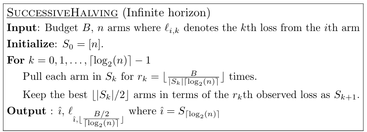
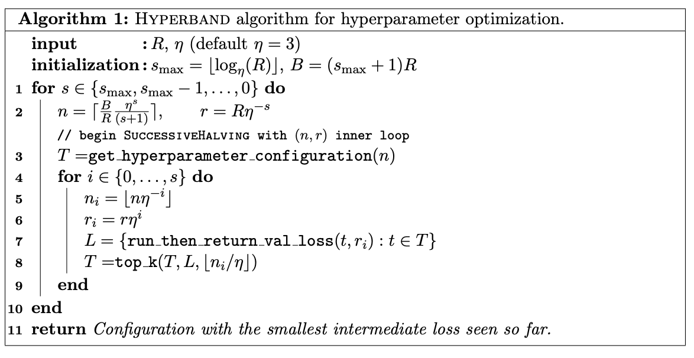

# 利用Ray+Tune进行机器学习/深度学习超参数调优

## Ray简介

+ Ray 是一个并行和分布式 Python 的开源库。
  
  + 从高层次上看，Ray 生态系统由三部分组成：
    + 核心 Ray 系统
    + 用于机器学习的可扩展库（包括原生库和第三方库）
    + 以及用于在任何集群或云提供商上启动集群的工具
  + Ray 的核心系统
  + Ray 可以用来在多个核心或机器上扩展 Python 应用。它有几个主要的优点，包括：
    + 简单性：你可以扩展你的 Python 应用，而不需要重写，同样的代码可以在一台机器或多台机器上运行。
    + 稳健性：应用程序可以优雅地处理机器故障和进程抢占。
    + 性能：任务以毫秒级的延迟运行，可扩展到数万个内核，并以最小的序列化开销处理数值数据。

## Ray Tune 简介

+ Ray Tune 是一个 Python 库，用于任何规模的实验执行和超参数调整，该库的一些优点是：
  
  + 能够在不到 10 行代码中启动多节点分布式超参数扫描。
  + 支持包括 PyTorch 在内的所有主流机器学习框架。
  + 对 GPU 的一流支持。
  + 自动管理检查点并将日志记录到 TensorBoard。
  + 访问最先进的算法，如基于群体的训练（PBT）、BayesOptSearch、HyperBand/ASHA。
+ Tune提供了开箱即用的分布式异步优化Ray. 您可以在不更改代码的情况下将超参数搜索从单台机器扩展到大型分布式集群
+ Tune 与许多优化库集成，如 Ax/Botorch, HyperOpt, 及Bayesian Optimization 贝叶斯优化 并且可以让你透明地扩展它们
+ Tune 支持任何机器学习框架，包括 PyTorch、 TensorFlow、 XGBoost、 LightGBM 和 Keras

## 基于Ray Tune的超参数优化算法理论基础

### 超参数优化问题

超参数是在算法运行之前手动设置的参数，用于控制模型的行为和性能。这些超参数的选择会影响到模型的训练速度、收敛性、容量和泛化能力等方面。例如，学习率、迭代次数、正则化参数、隐藏层的神经元数量等都是在深度学习中常见的超参数。超参数的选择通常是一个试错的过程，需要根据经验和领域知识进行调整。人工超参数优化通常效率较低，利用一些超参数优化算法可以实现机器学习模型的自动调优。

### 超参数优化算法

传统的超参数优化算法如下：

#### 1. 网格搜索算法（Gird Search）

##### 算法简介、定义

网格搜索法是指定参数值的一种穷举搜索方法，通过将估计函数的参数可通过交叉验证或在测试集验证的方法进行优化来得到最优的超参数。即，将各个参数可能的取值进行排列组合，列出所有可能的组合结果生成“网格”。

##### 算法分析

给定超参数的所有空间，网格搜索将生成所有的超参数组合，对于每一个超参数组合，网格搜索均进行一次实验，最终网格搜索将选定一次最优实验。对于超参数组合个数为N的一次优化尝试，其算法复杂度为全空间$O(N)$

##### 优点

+ 实现较为简单。
+ 每次实验均可以独立地完成，并行性较好。
+ 列出所有的可能值之后通常可以保证含有最优解。

##### 缺点

+ 由于网格搜索的搜索域为全空间，所以可能会导致计算量较大，调优的时间代价过高。

##### 适用场景

网格搜索算法适用于模型计算量较小、超参数空间较小的场景。或在计算资源充足的场景下进行超参数调优。

##### 具体实现与API

+ tune中，定义超参数空间时可以定义tune.grid_search告知ray tune需要进行网格搜索算法。
+ 在sklearn中GridSearchCV函数实现了带有交叉验证的超参数搜索算法。

##### 参考资料

[ray.tune.grid\_search — Ray 2.34.0](https://docs.ray.io/en/latest/tune/api/doc/ray.tune.grid_search.html)

[Working with Tune Search Spaces — Ray 2.34.0](https://docs.ray.io/en/latest/tune/tutorials/tune-search-spaces.html)

[机器学习之Grid Search网格搜索（自动调参）-CSDN博客](https://blog.csdn.net/qq_39521554/article/details/86227582)

[GridSearchCV — scikit-learn 1.5.1 documentation](https://scikit-learn.org/stable/modules/generated/sklearn.model_selection.GridSearchCV.html)

#### 2. 随机搜索算法（Random Search）

##### 算法简介、定义

随机搜索算法在网格搜索算法的基础上随机选择若干个超参数组合值进行实验，通过将估计函数的参数可通过交叉验证或在测试集验证的方法进行优化来得到最优的超参数，相较于搜索网格搜索减少了搜索空间。

##### 算法分析

给定超参数的所有空间，随机搜索将生成所有的超参数组合，对于每一个超参数组合，网格搜索均进行一次实验，最终网格搜索将选定一次最优实验。对于超参数组合个数为N，选择超参数采样点为M的一次优化尝试，其算法复杂度为选择空间$O(M)$

##### 优点

+ 实现较为简单。
+ 每次实验均可以独立地完成，并行性较好。
+ 相较于网格搜索计算代价更少。

##### 缺点

+ 由于随机采样选取超参数组合，可能错过超参数空间的最优值。

##### 适用场景

随机搜索算法适用于模型计算量较小、超参数空间较小的场景。或在计算资源充足的场景下进行超参数调优。

##### 参考资料

[随机搜索 | 机器之心 (jiqizhixin.com)](https://www.jiqizhixin.com/graph/technologies/c8b3090d-c81e-4141-a4ac-a86e193b3071)

[Working with Tune Search Spaces — Ray 2.34.0](https://docs.ray.io/en/latest/tune/tutorials/tune-search-spaces.html)

#### 3.SHA/ASHA算法（Successive Halving/异步Successive Halving算法)

##### 算法简介、定义

连续减半算法（Successive Halving Algorithm, SHA）适用于基于迭代的模型训练以机器学习优化算法，AHSA是SHA算法的异步版本。

SHA 的核心思想非常简单：

1. SHA 最开始给每个超参数组合一些计算资源额度（计算资源额度可以是神经网络的epoch、随机森林，GBDT的树的个数等）
2. 将这些超参数组合都训练执行一轮（Rung）后，对结果进行评估。
3. 选出排序靠前的超参数组合，进行下一轮（Rung）训练，性能较差的超参数组合早停。
4. 下一轮每个超参数组合的计算资源额度以一定的策略增加。

ASHA算法在上述思想的基础上实现了异步，即评价与训练同时进行，避免了SHA造成的停顿问题。

##### 算法分析

SHA的伪代码如下



ASHA的伪代码如下：


- $\eta$为实验的降低因子，在ASHA中，每轮次当中，评价标准在本轮前$1/\eta$的实验将被保留

ASHA的时间复杂度与实际实验当中的早停情况相关，理论上ASHA算法较相较于随机搜索算法/网格搜索在执行时间相同超参数空间上有时间优势。

##### 优点

+ 充分考虑的并行性。
+ 增加早停策略，节省计算资源。

##### 缺点

+ 早停机制的引入可能造成某些后续训练更优的超参数被提前终止训练。

##### 适用场景

+ 训练的模型超参数空间较大或者模型计算量较大的机器学习模型
+ 需要使用早停训练时

##### 具体实现与API

+ tune中ASHAScheduler实现了异步的ASHA算法，tune官方文档推荐使用此调度器进行优化

##### 参考资料

[Tune Trial Schedulers (tune.schedulers) — Ray 2.34.0](https://docs.ray.io/en/latest/tune/api/schedulers.html)

#### HyperBand/AsyncHyperBand

##### 算法简介、定义

Hyperband算法对SuccessiveHalving算法进行了扩展，HyperBand 提出了在不同预算（即轮数、时间）下频繁执行连续减半的方法，以找到最佳配置。

##### 算法分析

Hyperband 算法基于分层抽样和早期停止原则。其主要思路如下：

+ 分层抽样：不同于传统的网格搜索或随机搜索，Hyperband 使用了分层的预算分配方式。它首先定义了一个大的资源级别范围，然后将这些级别分成多个子集（称为“臂”），每个臂都有不同的资源（迭代次数）。
+ 早期终止：在每个臂上，一部分表现较差的模型会被提前淘汰，而表现较好的模型会获得更多的资源进行进一步训练。这种动态调整使得好的超参数组合能够更快地被识别出来。
+ 资源效率：由于模型在早期就能被评估，并且低效的配置被迅速剔除，因此 Hyperband 能以相对较小的预算找到接近最优的结果。


+ r: 单个超参数组合**实际**所能分配的预算

* R: 单个超参数组合所能分配的**最大**预算；
* $s_{max}$: 用来控制总预算的大小。
* **η**: 用于控制每次迭代后淘汰参数设置的比例,参见SHA/AHSA
* **get\_hyperparameter\_configuration(n)**:采样得到n组不同的超参数设置
* **run\_then\_return\_val\_loss(t,ri)**:根据指定的参数设置和预算计算valid loss。**L**表示在预算为**r**i的情况下各个超参数设置的验证误差

##### 参考资料

[[1603.06560] Hyperband: A Novel Bandit-Based Approach to Hyperparameter Optimization (arxiv.org)](https://arxiv.org/abs/1603.06560)

## 本实验简介

+ 项目结构

```text
Optimize_Project
│   MinstNet.py MINST模型的网络结构
│   optimize.py 优化函数封装
│   pytorch_test.py 基于MINST深度学习模型的超参数优化测试
│   sklearn_test.py 基于sklearn机器学习模型的超参数优化测试   
├───data MINST数据集
│   └───MNIST
│       └───......
│
......
```

+ 项目需求的扩展包

```text
ray
pytorch（建议使用GPU版本，结合CUDA版本官网安装）
torchvision（建议使用GPU版本，结合CUDA版本官网安装）
scikit-learn
及其依赖包（注意版本冲突）
```

实验参考版本及虚拟环境的所有库：

```text
Package                   Version
------------------------- ------------
aiosignal                 1.3.1
alembic                   1.13.2
attrs                     23.2.0
certifi                   2024.7.4
charset-normalizer        3.3.2
click                     8.1.7
colorama                  0.4.6
colorlog                  6.8.2
filelock                  3.13.1
frozenlist                1.4.1
fsspec                    2024.2.0
greenlet                  3.0.3
idna                      3.7
intel-openmp              2021.4.0
Jinja2                    3.1.3
joblib                    1.4.2
jsonschema                4.23.0
jsonschema-specifications 2023.12.1
Mako                      1.3.5
MarkupSafe                2.1.5
mkl                       2021.4.0
mpmath                    1.3.0
msgpack                   1.0.8
networkx                  3.2.1
numpy                     1.26.3
optuna                    3.6.1
packaging                 24.1
pandas                    2.2.2
pillow                    10.2.0
pip                       24.0
protobuf                  5.27.2
pyarrow                   16.1.0
python-dateutil           2.9.0.post0
pytz                      2024.1
PyYAML                    6.0.1
ray                       2.32.0
referencing               0.35.1
requests                  2.32.3
rpds-py                   0.19.0
scikit-learn              1.5.1
scipy                     1.14.0
setuptools                69.5.1
six                       1.16.0
SQLAlchemy                2.0.31
sympy                     1.12
tbb                       2021.11.0
threadpoolctl             3.5.0
torch                     2.3.1+cu121
torchaudio                2.3.1+cu121
torchvision               0.18.1+cu121
tqdm                      4.66.4
typing_extensions         4.9.0
tzdata                    2024.1
urllib3                   2.2.2
wheel                     0.43.0
```

### 优化pytorch深度学习

1. 构建目标模型，定义训练函数，一般训练函数为优化目标函数，在训练函数中设置训练的超参数，即config字典
   训练后需要向优化器报告优化目标变量，在深度学习模型中可以为损失函数或者测试集准确率

```python
class MinstNet(nn.Module):
    """
    MINST全连接网络结构
    :param l1: 第一个隐藏层的节点数
    :param l2: 第二个隐藏层的节点数
    """
    def __init__(self, l1: int, l2: int):
        super(MinstNet, self).__init__()
        self.layer1 = nn.Linear(in_features=28 * 28, out_features=l1)
        self.layer2 = nn.Linear(in_features=l1, out_features=l2)
        self.layer3 = nn.Linear(in_features=l2, out_features=10)

    def forward(self, x):
        x = x.view(-1, 28 * 28)
        x = F.relu(self.layer1(x))
        x = F.relu(self.layer2(x))
        x = self.layer3(x)
        return x
```

```python
def train_minst(config, data_dir=None, epochs=10):
    """
    训练MINST神经网络模型，并且报告loss与验证集上的精确度
    :param config: 调优参数以及待传递参数
    """
    # 实例化模型
    minst_net = MinstNet(l1=config['l1'], l2=config['l2'])

    # 适配训练设备，测试节点是否为单机多卡
    device = "cpu"
    if torch.cuda.is_available():
        device = "cuda:0"
        if torch.cuda.device_count() > 1:
            minst_net = nn.DataParallel(minst_net)
    minst_net.to(device)

    # 获取数据集
    train_set, test_set = load_data(data_dir=data_dir)
    train_dataloader = DataLoader(dataset=train_set, batch_size=config['batch_size'], shuffle=True)
    test_dataloader = DataLoader(dataset=test_set, batch_size=config['batch_size'])

    # 训练模型
    minst_net.train(True)
    lossF = nn.CrossEntropyLoss()  # 损失函数为交叉熵
    optimizer = optim.Adam(minst_net.parameters(), lr=config['lr'])  # 优化器
    for epoch in range(epochs):
        total_loss = 0
        for i, (images, labels) in enumerate(train_dataloader):
            images, labels = images.to(device), labels.to(device)
            minst_net.zero_grad()
            outputs = minst_net(images)
            loss = lossF(outputs, labels)
            total_loss += loss.item()
            loss.backward()
            optimizer.step()

    # 验证模型
    total_accuracy = 0
    minst_net.train(False)
    with torch.no_grad():
        for _, (images, labels) in enumerate(test_dataloader):
            images, labels = images.to(device), labels.to(device)
            outputs = minst_net(images)
            accuracy = (outputs.argmax(1) == labels).sum().item()
            total_accuracy = total_accuracy + accuracy

    # 向自动调优训练器报告精确度与损失函数
    train.report({
        "accuracy": total_accuracy / len(test_set),
        "loss": total_loss / len(train_set),
    })


```

2. 启动优化器，传入调度器设置每次实验占有的CPU、GPU资源等，Ray将自动进行并行多进程优化

```python
    # 定义搜索空间
    model_config = {
        "l1": tune.choice([512, 256]),  # 第一隐藏层节点数
        "l2": tune.choice([128, 64, 32]),  # 第二隐藏层节点数
        "lr": tune.choice([0.01, 0.001, 0.0001]),  # 学习率
        "batch_size": 64,
    }

    # 定义调度器 调度器提前结束一些不太有前景的试验，节省计算资源。
    # 调度器不是必须的
    scheduler = ASHAScheduler(
        max_t=10,
        grace_period=1,
        reduction_factor=2,
    )

    # 网格/随机网格搜索
    results = optimize_randomsearch(objective=partial(train_minst, epochs=10, data_dir=data_dir),  # 以minst模型训练函数为目的
                                    config=model_config,  # 搜索空间以及参数传递
                                    metric="loss",  # 优化损失函数
                                    mode="min",  # 目标为最小
                                    n_samples=10,  # 10个采样点
                                    scheduler=scheduler,  # 调度器
                                    cpus_per_trial=1,  # 每个实验分配的CPU资源为1
                                    gpus_per_trial=1,  # 每个实验分配的GPU资源为1
                                    )
```

由于笔记本仅有一台GPU，训练torch模型时基本无法并行，若传入的gpu_per_trail为0.5时可以并行


### 优化skearn机器学习模型

1. 与pytorch思路类似，定义、训练模型，报告优化参数：

```python
def train_wine(config):
    """
    以红酒数据集训练一个随机森林分类器
    :param config: 超参数
    """
    data = load_wine()
    X_train, X_test, y_train, y_test = train_test_split(data.data, data.target, test_size=0.2, random_state=0)

    clf_trail = RandomForestClassifier(**config)
    clf_trail.fit(X_train, y_train)
    train.report({
        'accuracy': clf_trail.score(X_train, y_train),
    })
```

2. 启动训练器，由于sklearn的模型为CPU计算，本实验环境为多核CPU（16）所以支持并行

```python
if __name__ == '__main__':
    config = {
        'n_estimators': tune.choice([50, 100, 200]),
        'max_depth': tune.choice([None, 1, 2, 3]),
        'max_features': tune.choice(['sqrt', 'log2', 3, 5, 8])
    }

    optimize_randomsearch(objective=train_wine,
                          config=config,
                          metric='accuracy',
                          mode='max',
                          n_samples=40,
                          scheduler=None,
                          cpus_per_trial=1,
                          gpus_per_trial=0)
```


运行结果

```text
Trial status: 40 TERMINATED
Current time: 2024-07-16 21:09:56. Total running time: 34s
Logical resource usage: 1.0/16 CPUs, 0/1 GPUs (0.0/1.0 accelerator_type:G)
Current best trial: 9e39c_00001 with accuracy=1.0 and params={'n_estimators': 200, 'max_depth': None, 'max_features': 'sqrt'}
╭──────────────────────────────────────────────────────────────────────────────────────────────────────────────────────────────╮
│ Trial name               status         n_estimators     max_depth   max_features       iter     total time (s)     accuracy │
├──────────────────────────────────────────────────────────────────────────────────────────────────────────────────────────────┤
│ train_wine_9e39c_00000   TERMINATED               50             3   3                     1          0.106965      0.992958 │
│ train_wine_9e39c_00001   TERMINATED              200                 sqrt                  1          0.433235      1        │
│ train_wine_9e39c_00002   TERMINATED               50             1   8                     1          0.108416      0.985915 │
│ train_wine_9e39c_00003   TERMINATED               50             2   3                     1          0.108376      0.985915 │
│ train_wine_9e39c_00004   TERMINATED               50                 sqrt                  1          0.112892      1        │
│ train_wine_9e39c_00005   TERMINATED               50             2   log2                  1          0.111058      0.992958 │
│ train_wine_9e39c_00006   TERMINATED              200             2   5                     1          0.412338      0.992958 │
│ train_wine_9e39c_00007   TERMINATED              100             3   5                     1          0.215202      0.992958 │
│ train_wine_9e39c_00008   TERMINATED               50             3   5                     1          0.112851      0.992958 │
│ train_wine_9e39c_00009   TERMINATED              100             2   3                     1          0.213226      0.992958 │
│ train_wine_9e39c_00010   TERMINATED              200             2   5                     1          0.407876      0.992958 │
│ train_wine_9e39c_00011   TERMINATED               50             3   8                     1          0.124883      1        │
│ train_wine_9e39c_00012   TERMINATED              100             3   5                     1          0.207623      0.992958 │
│ train_wine_9e39c_00013   TERMINATED              200                 5                     1          0.430002      1        │
│ train_wine_9e39c_00014   TERMINATED              200             3   5                     1          0.391786      1        │
│ train_wine_9e39c_00015   TERMINATED              100             1   8                     1          0.204133      0.950704 │
│ train_wine_9e39c_00016   TERMINATED               50             2   5                     1          0.106863      0.992958 │
│ train_wine_9e39c_00017   TERMINATED               50             3   sqrt                  1          0.10471       0.992958 │
│ train_wine_9e39c_00018   TERMINATED               50             2   log2                  1          0.114867      0.985915 │
│ train_wine_9e39c_00019   TERMINATED              100                 8                     1          0.239261      1        │
│ train_wine_9e39c_00020   TERMINATED               50             1   sqrt                  1          0.101107      0.985915 │
│ train_wine_9e39c_00021   TERMINATED               50             2   log2                  1          0.104315      0.985915 │
│ train_wine_9e39c_00022   TERMINATED              100             2   5                     1          0.21016       0.992958 │
│ train_wine_9e39c_00023   TERMINATED               50             3   5                     1          0.113359      1        │
│ train_wine_9e39c_00024   TERMINATED              200             1   3                     1          0.330568      0.985915 │
│ train_wine_9e39c_00025   TERMINATED              100             2   5                     1          0.198151      0.992958 │
│ train_wine_9e39c_00026   TERMINATED              200             1   sqrt                  1          0.363839      0.985915 │
│ train_wine_9e39c_00027   TERMINATED              100                 sqrt                  1          0.204698      1        │
│ train_wine_9e39c_00028   TERMINATED               50             1   sqrt                  1          0.107262      0.978873 │
│ train_wine_9e39c_00029   TERMINATED              200             2   log2                  1          0.384192      0.985915 │
│ train_wine_9e39c_00030   TERMINATED               50             2   5                     1          0.114751      0.992958 │
│ train_wine_9e39c_00031   TERMINATED              100             3   sqrt                  1          0.199715      0.992958 │
│ train_wine_9e39c_00032   TERMINATED              100             2   8                     1          0.13784       0.985915 │
│ train_wine_9e39c_00033   TERMINATED               50             1   8                     1          0.0665412     0.964789 │
│ train_wine_9e39c_00034   TERMINATED              200             2   3                     1          0.241613      0.985915 │
│ train_wine_9e39c_00035   TERMINATED               50             3   5                     1          0.0677676     1        │
│ train_wine_9e39c_00036   TERMINATED               50             3   log2                  1          0.0667748     0.992958 │
│ train_wine_9e39c_00037   TERMINATED               50             3   sqrt                  1          0.0505767     0.992958 │
│ train_wine_9e39c_00038   TERMINATED              200             3   5                     1          0.197688      1        │
│ train_wine_9e39c_00039   TERMINATED              200             1   3                     1          0.181669      0.985915 │
╰──────────────────────────────────────────────────────────────────────────────────────────────────────────────────────────────╯

2024-07-16 21:09:56,483	INFO tune.py:1009 -- Wrote the latest version of all result files and experiment state to 'C:/Users/Wangyx/ray_results/train_wine_2024-07-16_21-09-22' in 0.0785s.

```

### 调度器算法优化

#### SHA/ASHA算法

连续减半算法（Successive Halving Algorithm, SHA）[Karnin et al., 2013] 是 ASHA 的基础。SHA 的核心思想非常简单，如 图 8.5 所示：
SHA 最开始给每个超参数组合一些计算资源额度。
将这些超参数组合都训练执行完后，对结果进行评估。
选出排序靠前的超参数组合，进行下一轮（Rung）训练，性能较差的超参数组合早停。
下一轮每个超参数组合的计算资源额度以一定的策略增加。
SHA 中，需要等待同一轮所有超参数组合训练完并评估结果后，才能进入下一轮；
第一轮时，可以并行地执行多个试验，而进入到后几轮，试验越来越少，并行度越来越低。
ASHA 针对 SHA 进行了优化，ASHA 算法不需要等某一轮的训练和评估结束选出下一轮入选者，
而是在当前轮进行中的同时，选出可以提升到下一轮的超参数组合，前一轮的训练评估与下一轮的训练评估是同步进行的。


```text
Trial train_minst_5e3f3_00017 completed after 2 iterations at 2024-07-26 15:15:08. Total running time: 3min 1s

Trial status: 18 TERMINATED
Current time: 2024-07-26 15:15:08. Total running time: 3min 1s
Logical resource usage: 1.0/16 CPUs, 0.2/1 GPUs (0.0/1.0 accelerator_type:G)
╭───────────────────────────────────────────────────────────────────────────────────────────────────────────────────╮
│ Trial name                status         l1     l2       lr     iter     total time (s)     accuracy         loss │
├───────────────────────────────────────────────────────────────────────────────────────────────────────────────────┤
│ train_minst_5e3f3_00000   TERMINATED    512    128   0.01         10           131.865        0.9541   0.00245912 │
│ train_minst_5e3f3_00001   TERMINATED    256    128   0.01          2            27.5071       0.908    0.0058352  │
│ train_minst_5e3f3_00002   TERMINATED    512     64   0.01         10           132.003        0.9532   0.00251337 │
│ train_minst_5e3f3_00003   TERMINATED    256     64   0.01          2            27.3771       0.8969   0.00599872 │
│ train_minst_5e3f3_00004   TERMINATED    512     32   0.01          2            27.4553       0.905    0.00595547 │
│ train_minst_5e3f3_00005   TERMINATED    256     32   0.01          2            26.5815       0.9001   0.00604267 │
│ train_minst_5e3f3_00006   TERMINATED    512    128   0.001         2            26.8063       0.6857   0.0293165  │
│ train_minst_5e3f3_00007   TERMINATED    256    128   0.001         2            26.9067       0.679    0.0303563  │
│ train_minst_5e3f3_00008   TERMINATED    512     64   0.001         2            26.255        0.6863   0.0284186  │
│ train_minst_5e3f3_00009   TERMINATED    256     64   0.001         2            25.9281       0.6704   0.030087   │
│ train_minst_5e3f3_00010   TERMINATED    512     32   0.001         2            25.7186       0.5687   0.0301437  │
│ train_minst_5e3f3_00011   TERMINATED    256     32   0.001         2            26.8145       0.5574   0.0303877  │
│ train_minst_5e3f3_00012   TERMINATED    512    128   0.0001        2            27.3081       0.1728   0.0356387  │
│ train_minst_5e3f3_00013   TERMINATED    256    128   0.0001        2            26.9262       0.1196   0.0358289  │
│ train_minst_5e3f3_00014   TERMINATED    512     64   0.0001        2            27.4283       0.1386   0.0355024  │
│ train_minst_5e3f3_00015   TERMINATED    256     64   0.0001        2            27.2915       0.2017   0.0357294  │
│ train_minst_5e3f3_00016   TERMINATED    512     32   0.0001        2            26.962        0.1668   0.0356187  │
│ train_minst_5e3f3_00017   TERMINATED    256     32   0.0001        2            27.0441       0.1612   0.0357623  │
╰───────────────────────────────────────────────────────────────────────────────────────────────────────────────────╯

2024-07-26 15:15:08,772	INFO tune.py:1009 -- Wrote the latest version of all result files and experiment state to 'C:/Users/Wangyx/ray_results/train_minst_2024-07-26_15-12-07' in 0.0367s.
{'l1': 512, 'l2': 128, 'lr': 0.01, 'batch_size': 64}
C:/Users/Wangyx/ray_results/train_minst_2024-07-26_15-12-07
```

#### HyperBand算法

假设一开始候选的超参数组合数量是 n ，那么分配到每个超参数组的预算就是
B/n 。所以Hyperband做的事情就是在 n 与 B/ n 做权衡(tradeoff)。
上面这句话什么意思呢？也就是说如果我们希望候选的超参数越多越好，
因为这样能够包含最优超参数的可能性也就越大，但是此时分配到每个超参数组的预算也就越少，
那么找到最优超参数的可能性就降低了。反之亦然。所以Hyperband要做的事情就是预设尽可能多的超参数组合数量，
并且每组超参数所分配的预算也尽可能的多，从而确保尽可能地找到最优超参数。

HyperBand 算法在 SHA 基础上提出了一种对冲机制。HyperBand 有点像金融投资组合，使用多种金融资产来对冲风险，
初始轮不是一个固定的 n ，而是有多个可能的n


AsyncHyperBandScheduler 是 Ray Tune 推荐的 HyperBand 算法的实现， 它是异步的，能够更充分利用计算资源

```text
Trial train_minst_f3bbe_00015 completed after 10 iterations at 2024-07-26 15:21:42. Total running time: 5min 24s
2024-07-26 15:21:42,254	INFO tune.py:1009 -- Wrote the latest version of all result files and experiment state to 'C:/Users/Wangyx/ray_results/train_minst_2024-07-26_15-16-18' in 0.0338s.

Trial status: 18 TERMINATED
Current time: 2024-07-26 15:21:42. Total running time: 5min 24s
Logical resource usage: 1.0/16 CPUs, 0.2/1 GPUs (0.0/1.0 accelerator_type:G)
╭───────────────────────────────────────────────────────────────────────────────────────────────────────────────────╮
│ Trial name                status         l1     l2       lr     iter     total time (s)     accuracy         loss │
├───────────────────────────────────────────────────────────────────────────────────────────────────────────────────┤
│ train_minst_f3bbe_00000   TERMINATED    512    128   0.01          8           113.513        0.944    0.00306838 │
│ train_minst_f3bbe_00001   TERMINATED    256    128   0.01         10           141.852        0.948    0.00256753 │
│ train_minst_f3bbe_00002   TERMINATED    512     64   0.01          2            28.1076       0.9006   0.00592203 │
│ train_minst_f3bbe_00003   TERMINATED    256     64   0.01          2            27.9547       0.9032   0.00593104 │
│ train_minst_f3bbe_00004   TERMINATED    512     32   0.01         10           142.591        0.9538   0.0025343  │
│ train_minst_f3bbe_00005   TERMINATED    256     32   0.01          2            28.4095       0.9044   0.00600739 │
│ train_minst_f3bbe_00006   TERMINATED    512    128   0.001         2            28.4872       0.6988   0.028836   │
│ train_minst_f3bbe_00007   TERMINATED    256    128   0.001         2            28.3291       0.6918   0.028647   │
│ train_minst_f3bbe_00008   TERMINATED    512     64   0.001         8           115.542        0.881    0.00738984 │
│ train_minst_f3bbe_00009   TERMINATED    256     64   0.001         2            29.3433       0.5876   0.0286084  │
│ train_minst_f3bbe_00010   TERMINATED    512     32   0.001         2            29.773        0.5924   0.0283093  │
│ train_minst_f3bbe_00011   TERMINATED    256     32   0.001         8           105.511        0.8684   0.00815949 │
│ train_minst_f3bbe_00012   TERMINATED    512    128   0.0001        2            29.1626       0.2252   0.0355244  │
│ train_minst_f3bbe_00013   TERMINATED    256    128   0.0001        2            28.6747       0.257    0.0356203  │
│ train_minst_f3bbe_00014   TERMINATED    512     64   0.0001        2            28.7914       0.2041   0.03563    │
│ train_minst_f3bbe_00015   TERMINATED    256     64   0.0001       10           124.604        0.4049   0.03301    │
│ train_minst_f3bbe_00016   TERMINATED    512     32   0.0001        2            26.2343       0.1405   0.0357382  │
│ train_minst_f3bbe_00017   TERMINATED    256     32   0.0001        8            99.3855       0.4489   0.0333834  │
╰───────────────────────────────────────────────────────────────────────────────────────────────────────────────────╯

{'l1': 512, 'l2': 32, 'lr': 0.01, 'batch_size': 64}
C:/Users/Wangyx/ray_results/train_minst_2024-07-26_15-16-18
```

#### PBT算法
