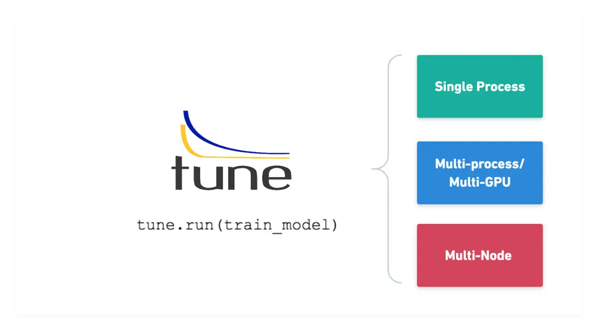

# 利用Ray+Tune进行机器学习/深度学习超参数调优

## Ray简介

+ Ray 是一个并行和分布式 Python 的开源库。
  
  + 从高层次上看，Ray 生态系统由三部分组成：
    + 核心 Ray 系统
    + 用于机器学习的可扩展库（包括原生库和第三方库）
    + 以及用于在任何集群或云提供商上启动集群的工具
  + Ray 的核心系统
  + Ray 可以用来在多个核心或机器上扩展 Python 应用。它有几个主要的优点，包括：
    + 简单性：你可以扩展你的 Python 应用，而不需要重写，同样的代码可以在一台机器或多台机器上运行。
    + 稳健性：应用程序可以优雅地处理机器故障和进程抢占。
    + 性能：任务以毫秒级的延迟运行，可扩展到数万个内核，并以最小的序列化开销处理数值数据。

## Ray Tune 简介

+ Ray Tune 是一个 Python 库，用于任何规模的实验执行和超参数调整，该库的一些优点是：
  
  + 能够在不到 10 行代码中启动多节点分布式超参数扫描。
  + 支持包括 PyTorch 在内的所有主流机器学习框架。
  + 对 GPU 的一流支持。
  + 自动管理检查点并将日志记录到 TensorBoard。
  + 访问最先进的算法，如基于群体的训练（PBT）、BayesOptSearch、HyperBand/ASHA。
+ Tune提供了开箱即用的分布式异步优化Ray. 您可以在不更改代码的情况下将超参数搜索从单台机器扩展到大型分布式集群
+ Tune 与许多优化库集成，如 Ax/Botorch, HyperOpt, 及Bayesian Optimization 贝叶斯优化 并且可以让你透明地扩展它们
+ Tune 支持任何机器学习框架，包括 PyTorch、 TensorFlow、 XGBoost、 LightGBM 和 Keras

## 基于Ray Tune的超参数优化算法理论基础

### 超参数优化问题

超参数是在算法运行之前手动设置的参数，用于控制模型的行为和性能。这些超参数的选择会影响到模型的训练速度、收敛性、容量和泛化能力等方面。例如，学习率、迭代次数、正则化参数、隐藏层的神经元数量等都是在深度学习中常见的超参数。超参数的选择通常是一个试错的过程，需要根据经验和领域知识进行调整。人工超参数优化通常效率较低，利用一些超参数优化算法可以实现机器学习模型的自动调优。

### 超参数优化算法

本次主要研究的超参数优化算法如下：

#### 1. 网格搜索算法（Gird Search）

##### 算法简介、定义

网格搜索法是指定参数值的一种穷举搜索方法，通过将估计函数的参数可通过交叉验证或在测试集验证的方法进行优化来得到最优的超参数。即，将各个参数可能的取值进行排列组合，列出所有可能的组合结果生成“网格”。

##### 算法分析

给定超参数的所有空间，网格搜索将生成所有的超参数组合，对于每一个超参数组合，网格搜索均进行一次实验，最终网格搜索将选定一次最优实验。对于超参数组合个数为N的一次优化尝试，其算法复杂度为全空间$O(N)$

##### 优点

+ 实现较为简单。
+ 每次实验均可以独立地完成，并行性较好。
+ 列出所有的可能值之后通常可以保证含有最优解。

##### 缺点

+ 由于网格搜索的搜索域为全空间，所以可能会导致计算量较大，调优的时间代价过高。

##### 适用场景

网格搜索算法适用于模型计算量较小、超参数空间较小的场景。或在计算资源充足的场景下进行超参数调优。

##### 具体实现与API

+ tune中，定义超参数空间时可以定义tune.grid_search告知ray tune需要进行网格搜索算法。
+ 在sklearn中GridSearchCV函数实现了带有交叉验证的超参数搜索算法。

##### 参考资料

[ray.tune.grid\_search — Ray 2.34.0](https://docs.ray.io/en/latest/tune/api/doc/ray.tune.grid_search.html)

[Working with Tune Search Spaces — Ray 2.34.0](https://docs.ray.io/en/latest/tune/tutorials/tune-search-spaces.html)

[机器学习之Grid Search网格搜索（自动调参）-CSDN博客](https://blog.csdn.net/qq_39521554/article/details/86227582)

[GridSearchCV — scikit-learn 1.5.1 documentation](https://scikit-learn.org/stable/modules/generated/sklearn.model_selection.GridSearchCV.html)

#### 2. 随机搜索算法（Random Search）

##### 算法简介、定义

随机搜索算法在网格搜索算法的基础上随机选择若干个超参数组合值进行实验，通过将估计函数的参数可通过交叉验证或在测试集验证的方法进行优化来得到最优的超参数，相较于搜索网格搜索减少了搜索空间。

##### 算法分析

给定超参数的所有空间，随机搜索将生成所有的超参数组合，对于每一个超参数组合，网格搜索均进行一次实验，最终网格搜索将选定一次最优实验。对于超参数组合个数为N，选择超参数采样点为M的一次优化尝试，其算法复杂度为选择空间$O(M)$

##### 优点

+ 实现较为简单。
+ 每次实验均可以独立地完成，并行性较好。
+ 相较于网格搜索计算代价更少。

##### 缺点

+ 由于随机采样选取超参数组合，可能错过超参数空间的最优值。

##### 适用场景

随机搜索算法适用于模型计算量较小、超参数空间较小的场景。或在计算资源充足的场景下进行超参数调优。

##### 参考资料

[随机搜索 | 机器之心 (jiqizhixin.com)](https://www.jiqizhixin.com/graph/technologies/c8b3090d-c81e-4141-a4ac-a86e193b3071)

[Working with Tune Search Spaces — Ray 2.34.0](https://docs.ray.io/en/latest/tune/tutorials/tune-search-spaces.html)

#### 3.SHA/ASHA算法（Successive Halving/异步Successive Halving算法)

##### 算法简介、定义

连续减半算法（Successive Halving Algorithm, SHA）适用于基于迭代的模型训练以机器学习优化算法，AHSA是SHA算法的异步版本。

SHA 的核心思想非常简单：

1. SHA 最开始给每个超参数组合一些计算资源额度（计算资源额度可以是神经网络的epoch、随机森林，GBDT的树的个数等）
2. 将这些超参数组合都训练执行一轮（Rung）后，对结果进行评估。
3. 选出排序靠前的超参数组合，进行下一轮（Rung）训练，性能较差的超参数组合早停。
4. 下一轮每个超参数组合的计算资源额度以一定的策略增加。

ASHA算法在上述思想的基础上实现了异步，即评价与训练同时进行，避免了SHA造成的停顿问题。

下图给出了一个SHA算法的图解示例，例如基于轮数训练一个模型并且损失函数值loss为评分，此时下图很好的给出了早停策略的思想，在此样例当中训练每增加一轮，一半的训练实验将被淘汰：


##### 算法分析

SHA的伪代码如下


**算法步骤**：

1. **计算最大轮数（rungs）**:
   * 使用`s_max = log_η(R/r)`计算需要进行的最大轮数（或称为“rungs”）。这个计算确保了至少有一个配置能够使用最大资源量`R`。
2. **断言**:
   * 确保`n`足够大，即`n ≥ η^(s_max - s)`，以保证至少有一个配置能够到达最大轮数。
3. **获取初始配置**:
   * 使用`get hyperparameter configuration(n)`函数从给定的搜索空间中随机获取`n`个初始配置。
4. **主循环**:
   * 对于每一轮（或称为“rung”），从`0`迭代到`s_max - s - 1`。
     * 在每轮开始时，计算当前轮的配置数`n_i = n * η^(-i)`和每个配置的资源量`r_i = r * η^(i + s)`。
     * 对当前轮的所有配置进行训练和评估，得到它们的验证损失。
     * 选择表现最好的`n_i / η`个配置（即淘汰一半）进入下一轮。

ASHA的伪代码如下：


- $\eta$为实验的降低因子，在ASHA中，每轮次当中，评价标准在本轮前$1/\eta$的实验将被保留

ASHA的时间复杂度与实际实验当中的情况相关，理论上ASHA算法较相较于随机搜索算法/网格搜索在执行时间相同超参数空间上有时间优势。

##### 优点

+ 充分考虑的并行性。
+ 增加早停策略，节省计算资源。

##### 缺点

+ 早停机制的引入可能造成某些后续训练更优的超参数被提前终止训练。

##### 适用场景

+ 训练的模型超参数空间较大或者模型计算量较大的机器学习模型
+ 需要使用早停训练时

##### 具体实现与API

+ tune中ASHAScheduler实现了异步的ASHA算法，tune官方文档推荐使用此调度器进行优化

##### 参考资料

[Tune Trial Schedulers (tune.schedulers) — Ray 2.34.0](https://docs.ray.io/en/latest/tune/api/schedulers.html)

#### 4.贝叶斯优化算法

##### 算法简介、定义

贝叶斯优化是基于数据使用贝叶斯定理估计目标函数的后验分布，然后再根据分布选择下一个采样的超参数组合。它充分利用了前一个采样点的信息，其优化的工作方式是通过对目标函数形状的学习，并找到使结果向全局最大提升的参数

**高斯过程** 用于在贝叶斯优化中对目标函数建模，得到其后验分布


通过高斯过程建模之后，我们尝试抽样进行样本计算，而贝叶斯优化很容易在局部最优解上不断采样，这就涉及到了开发和探索之间的权衡。

* 开发 (exploitation)： 根据后验分布，在最可能出现全局最优解的区域进行采样, 开发高意味着均值高
* 探索 (exploration): 在还未取样的区域获取采样点， 探索高意味着方差高

而如何高效的采样，即开发和探索，我们需要用到 **Acquisition Function**, 它是用来寻找下一个 x 的函数。

acquisition Function函数则是由均值和方差计算得出，理应要找到最大的那个点才是最合适的取值点。

Optuna的默认采样器为TPE（Tree-structured Parzen Estimator）来确定下一个实验超参数的位置。在每次试验中，对于每个超参，TPE 为与最佳目标值相关的超参维护一个高斯混合模型 l(x)，为剩余的超参维护另一个高斯混合模型 g(x)，选择 l(x)/g(x)最大化时对应的超参作为下一组搜索值。通过这种方式，TPE 算法能够自适应地调整参数搜索空间的大小，并且能够在尽可能少的迭代次数内找到全局最优解。TPE 选择期望改进（expected improvement，EI）作为采集函数。

TPE要求所有的超参数要相互独立，即一种正交的概念，即效果不能相互影响，例如学习率，提升树方法的迭代次数，和树的最大深度就存在一个权衡，所以需要先固定一些不能一起用于优化的超参数，如固定学习率和迭代次数。

##### 参考资料

[强大而精致的机器学习调参方法：贝叶斯优化 - 杨睿 - 博客园 (cnblogs.com)](https://www.cnblogs.com/yangruiGB2312/p/9374377.html)

[学习笔记--贝叶斯优化\_acquisition function-CSDN博客](https://blog.csdn.net/weixin_43915875/article/details/89642364)

[TPE | Liu Xiyang (liuxiyang641.github.io)](https://liuxiyang641.github.io/ml/TPE/)

##### 针对SHA/ASHA的改进算法Hyperband

[机器学习超参数优化算法-Hyperband-腾讯云开发者社区-腾讯云 (tencent.com)](https://cloud.tencent.com/developer/article/1379752)

[[1603.06560] Hyperband: A Novel Bandit-Based Approach to Hyperparameter Optimization (arxiv.org)](https://arxiv.org/abs/1603.06560)

#### 5.PBT(Population Based Training 种群优化训练)

##### 算法简介、定义

自动化调优两种常用的自动调参的方式是**并行搜索(parallel search)**和**序列优化(sequential optimisation)**。并行搜索就是同时设置多组参数训练，比如网格搜索(grid search)和随机搜索(random search)。序列优化很少用到并行，而是一次次尝试并优化，比如人工调参(hand tuning)和贝叶斯优化(Bayesian optimisation)。并行搜索的缺点在于没有利用相互之间的参数优化信息。而序列优化这种序列化过程显然会耗费大量时间。还有另一个问题是，对于有些超参数，在训练过程中并不是一直不变的。比如监督训练里的学习率，强化学习中的探索度等等。通常的做法是给一个固定的衰减值，而在强化学习这类问题里还会随不同场景做不同调整。这无疑很难找到一个最优的自动调节方式。


PBT算法将并行优化和序列优化相结合。既能并行探索，同时也利用其他更好的参数模型，淘汰掉不好的模型。

PBT算法适用于基于迭代的机器学习的训练，PBT并行地训练多个模型并称之为训练群体，在规定到达规定轮次时，PBT会在群体当中的某些实验中舍弃一些较差的模型并且替换为群体当中较好的模型，之后将在较好的模型当中探索新的超参数组合。这样的策略可以使得计算资源分配给更有前途的模型从而训练得到更优的模型和较优的超参数组合。

##### 算法分析

PBT有以下几个核心步骤：


+ Step：对模型训练一步。
+ Eval：在验证集上做评估。
+ Ready: 选取群体中的一个模型来进行下面的exploit和explore操作（即perturbation）。
+ Exploit: 将那些经过评估比较烂的模型用那些较优的模型替代。
+ Explore: 对上一步产生的复制体模型加随机扰动，如加上/减去随机值或重采样。

首先PBT算法随机初始化多个模型，每训练一段时间设置一个检查点(checkpoint)，然后根据其他模型的好坏调整自己的模型。若自己的模型较好，则继续训练。若不好，则替换(exploit)成更好的模型参数，并添加随机扰动(explore)再进行训练。其中checkpoint的设置是人为设置每过多少step之后进行检查。扰动要么在原超参数或者参数上加噪声，要么重新采样获得。作者还写了几个公式来规范说明这个问题。

PBT相较于随机搜索算法由于存在模型的交换、超参数的探索，所以在时间复杂度上PBT算法比随机搜索算法可能更大，但是相较于随机搜索PBT会利用群体当中其他个体的最优模型，所以在模型最终训练的效果上PBT会比简单的随机搜索各个实验独立的情况更胜一筹。

##### 优点

+ PBT结合了序列化以及并行思想，在效率以及优化方式上做了权衡
+ PBT在训练时利用explore操作自动调节超参数，在某些情况可能产生更好的结果

##### 缺点

+ PBT可能需要反复读取、保存检查点，训练函数可能稍微麻烦，并且IO存在开销。
+ 对算力要求可能更高。
+ 对于在explore操作时需要自行编写修改超参数的代码，对于灵活性较差的框架较为麻烦。

##### 适用场景

+ PBT适用于对模型精度要求较高的训练，因为它每次利用最优模型进行训练与explore。
+ PBT适用于超参数修改方便的超参数，因为每次训练时explore修改超参数需要编写动态修改超参数的代码。

##### 参考资料

[A Guide to Population Based Training with Tune — Ray 2.34.0](https://docs.ray.io/en/latest/tune/examples/pbt_guide.html)

[超参数自动优化方法PBT（Population Based Training）\_population-based training-CSDN博客](https://blog.csdn.net/jinzhuojun/article/details/100047416)

[《Population Based Training of Neural Networks》论文解读 - initial\_h - 博客园 (cnblogs.com)](https://www.cnblogs.com/initial-h/p/10519150.html)

[PBT Function Example — Ray 2.34.0](https://docs.ray.io/en/latest/tune/examples/includes/pbt_function.html)

## 本实验简介

+ 项目结构

```text
Ray_Tune_Optimize
│   example_ASHA_optimize.py  #ASHA连续减半优化示例
│   example_Optuna_optimize.py #基于Optuna的贝叶斯优化示例
│   example_PBT_optimize.py #PBT种群优化示例
│   example_Random_optimize.py #随机搜索示例
│   MinstNet.py #神经网络结构
|   optimize.py #封装了优化的核心调用代码
│   README.md
│   requirements.txt
│
├───data #数据集
│   └───MNIST
│
```

+ 项目需求的扩展包

```text
ray
optuna
pytorch（建议使用GPU版本，结合CUDA版本官网安装）
torchvision（建议使用GPU版本，结合CUDA版本官网安装）
scikit-learn
及其依赖包（注意版本冲突）
```

实验参考版本及虚拟环境的所有库：

```text
Package                   Version
------------------------- ------------
aiosignal                 1.3.1
alembic                   1.13.2
attrs                     23.2.0
certifi                   2024.7.4
charset-normalizer        3.3.2
click                     8.1.7
colorama                  0.4.6
colorlog                  6.8.2
filelock                  3.13.1
frozenlist                1.4.1
fsspec                    2024.2.0
greenlet                  3.0.3
idna                      3.7
intel-openmp              2021.4.0
Jinja2                    3.1.3
joblib                    1.4.2
jsonschema                4.23.0
jsonschema-specifications 2023.12.1
Mako                      1.3.5
MarkupSafe                2.1.5
mkl                       2021.4.0
mpmath                    1.3.0
msgpack                   1.0.8
networkx                  3.2.1
numpy                     1.26.3
optuna                    3.6.1
packaging                 24.1
pandas                    2.2.2
pillow                    10.2.0
pip                       24.0
protobuf                  5.27.2
pyarrow                   16.1.0
python-dateutil           2.9.0.post0
pytz                      2024.1
PyYAML                    6.0.1
ray                       2.32.0
referencing               0.35.1
requests                  2.32.3
rpds-py                   0.19.0
scikit-learn              1.5.1
scipy                     1.14.0
setuptools                69.5.1
six                       1.16.0
SQLAlchemy                2.0.31
sympy                     1.12
tbb                       2021.11.0
threadpoolctl             3.5.0
torch                     2.3.1+cu121
torchaudio                2.3.1+cu121
torchvision               0.18.1+cu121
tqdm                      4.66.4
typing_extensions         4.9.0
tzdata                    2024.1
urllib3                   2.2.2
wheel                     0.43.0
```

### 超参数优化步骤

### 超参数调优样例

#### 随机搜索算法

*example_Random_optimize.py*展示了一个随机搜索算法参数调优实例，运行结果如下，部分ERROR由内存不足产生：

```text
Trial status: 18 TERMINATED | 2 ERROR
Current time: 2024-08-02 14:57:42. Total running time: 9min 31s
Logical resource usage: 1.0/16 CPUs, 0.2/1 GPUs (0.0/1.0 accelerator_type:G)
Current best trial: 2f1d6_00014 with test_accuracy=0.9793 and params={'l1': 256, 'l2': 64, 'lr': 0.07728843418600151, 'batch_size': 64}
╭───────────────────────────────────────────────────────────────────────────────────────────────────────────────────────────────────────────╮
│ Trial name                status         l1     l2          lr     iter     total time (s)     test_accuracy     train_loss     test_loss │
├───────────────────────────────────────────────────────────────────────────────────────────────────────────────────────────────────────────┤
│ train_minst_2f1d6_00000   TERMINATED    256     64   0.0341922       10            122.783            0.9756      0.0644103     0.0764139 │
│ train_minst_2f1d6_00001   TERMINATED    256     32   0.046505        10            124.366            0.9592      0.0534589     0.130015  │
│ train_minst_2f1d6_00002   TERMINATED    512     16   0.0700535       10            124.532            0.9758      0.0368675     0.0820533 │
│ train_minst_2f1d6_00003   TERMINATED    256     16   0.0306663       10            123.723            0.9719      0.0680217     0.0918843 │
│ train_minst_2f1d6_00004   TERMINATED    256     64   0.0194224       10            124.033            0.9676      0.0999565     0.106553  │
│ train_minst_2f1d6_00005   TERMINATED    512     64   0.0905747       10            136.707            0.9788      0.0330426     0.0685328 │
│ train_minst_2f1d6_00006   TERMINATED    256     16   0.0886238       10            136.587            0.9783      0.0432903     0.0734451 │
│ train_minst_2f1d6_00007   TERMINATED    256    128   0.0258714       10            136.856            0.9725      0.0802419     0.0909622 │
│ train_minst_2f1d6_00008   TERMINATED    512     16   0.0398463       10            137.738            0.9773      0.0527595     0.0713123 │
│ train_minst_2f1d6_00009   TERMINATED    256     32   0.0691715       10            137.429            0.9771      0.0439076     0.0715766 │
│ train_minst_2f1d6_00010   TERMINATED    256     32   0.0296836       10            129.438            0.9595      0.0692892     0.123758  │
│ train_minst_2f1d6_00013   TERMINATED    256    128   0.096348        10            146.452            0.9759      0.0391772     0.0777141 │
│ train_minst_2f1d6_00014   TERMINATED    256     64   0.0772884       10            147.428            0.9793      0.0399386     0.0669168 │
│ train_minst_2f1d6_00015   TERMINATED    512     32   0.046992        10            131.539            0.9744      0.0476808     0.081293  │
│ train_minst_2f1d6_00016   TERMINATED    256     32   0.0155724       10            131.013            0.9656      0.118457      0.119304  │
│ train_minst_2f1d6_00017   TERMINATED    512    128   0.0750416       10            136.907            0.9789      0.0378324     0.0669482 │
│ train_minst_2f1d6_00018   TERMINATED    512     16   0.0730678       10            135.092            0.9787      0.0372591     0.0631244 │
│ train_minst_2f1d6_00019   TERMINATED    256     64   0.0933773       10            134.931            0.9787      0.0379942     0.0730253 │
│ train_minst_2f1d6_00011   ERROR         512     64   0.0976782                                                                            │
│ train_minst_2f1d6_00012   ERROR         512    128   0.0866732                                                                            │
╰───────────────────────────────────────────────────────────────────────────────────────────────────────────────────────────────────────────╯
```

#### SHA/ASHA算法

*example_ASHA_optimize.py*展示了一个AHSA算法的超参数调优实例，运行结果如下所示，可以预见其相较于随机搜索算法加入了早停机制，使得

```plaintext

Trial status: 20 TERMINATED
Current time: 2024-08-02 12:22:36. Total running time: 5min 49s
Logical resource usage: 1.0/16 CPUs, 0.2/1 GPUs (0.0/1.0 accelerator_type:G)
╭───────────────────────────────────────────────────────────────────────────────────────────────────────────────────────────────────────────╮
│ Trial name                status         l1     l2          lr     iter     total time (s)     test_accuracy     train_loss     test_loss │
├───────────────────────────────────────────────────────────────────────────────────────────────────────────────────────────────────────────┤
│ train_minst_08758_00000   TERMINATED    512     16   0.0230553        4            50.1062            0.9479      0.18903       0.170751  │
│ train_minst_08758_00001   TERMINATED    256     16   0.085642         4            50.2977            0.956       0.1037        0.136488  │
│ train_minst_08758_00002   TERMINATED    512    128   0.0215889        2            25.0868            0.9206      0.298597      0.259152  │
│ train_minst_08758_00003   TERMINATED    512    128   0.0456325       10           129.35              0.975       0.0465825     0.0751438 │
│ train_minst_08758_00004   TERMINATED    512     16   0.044007         8           101.851             0.9613      0.0660839     0.123285  │
│ train_minst_08758_00005   TERMINATED    256     32   0.0167836        2            25.4321            0.9125      0.331019      0.289368  │
│ train_minst_08758_00006   TERMINATED    512     64   0.0301308        4            52.0522            0.9493      0.156614      0.162634  │
│ train_minst_08758_00007   TERMINATED    512    128   0.0277159        2            25.5121            0.9263      0.274653      0.241853  │
│ train_minst_08758_00008   TERMINATED    512     64   0.0462428        8           111.43              0.9577      0.0605491     0.133378  │
│ train_minst_08758_00009   TERMINATED    512     16   0.0548533       10           143.613             0.9665      0.0416978     0.110345  │
│ train_minst_08758_00010   TERMINATED    512     16   0.0117013        2            29.5035            0.9096      0.362259      0.310431  │
│ train_minst_08758_00011   TERMINATED    512    128   0.0575273        4            58.757             0.9543      0.107283      0.137821  │
│ train_minst_08758_00012   TERMINATED    256     64   0.0256682        2            29.1008            0.9138      0.28882       0.272699  │
│ train_minst_08758_00013   TERMINATED    256     16   0.0860616       10           135.105             0.9729      0.0442914     0.0907238 │
│ train_minst_08758_00014   TERMINATED    256     64   0.0117321        2            28.2246            0.9059      0.359614      0.316788  │
│ train_minst_08758_00015   TERMINATED    512     32   0.0432705        2            28.8358            0.9271      0.22903       0.231988  │
│ train_minst_08758_00016   TERMINATED    256     32   0.094357         2            28.9317            0.9083      0.175057      0.266203  │
│ train_minst_08758_00017   TERMINATED    512    128   0.0854735       10           124.367             0.9754      0.0332617     0.0825437 │
│ train_minst_08758_00018   TERMINATED    256     16   0.0668694        2            26.6788            0.9174      0.192669      0.260876  │
│ train_minst_08758_00019   TERMINATED    256     16   0.0568054        8            97.551             0.9679      0.0616598     0.100452  │
╰───────────────────────────────────────────────────────────────────────────────────────────────────────────────────────────────────────────╯
```

#### PBT算法

```plaintext

Trial status: 20 TERMINATED
Current time: 2024-08-01 22:18:50. Total running time: 14min 6s
Logical resource usage: 1.0/16 CPUs, 0.2/1 GPUs (0.0/1.0 accelerator_type:G)
╭──────────────────────────────────────────────────────────────────────────────────────────────────────────────────────────────────────────────────────────╮
│ Trial name                                status              lr     momentum     iter     total time (s)     test_accuracy     train_loss     test_loss │
├──────────────────────────────────────────────────────────────────────────────────────────────────────────────────────────────────────────────────────────┤
│ train_minst_with_checkpoint_00f6a_00000   TERMINATED   0.0618864     0.164179       10            128.954            0.9788      0.0360954     0.064581  │
│ train_minst_with_checkpoint_00f6a_00001   TERMINATED   0.0486905     0.219553       10            131.93             0.9755      0.0403308     0.0759309 │
│ train_minst_with_checkpoint_00f6a_00002   TERMINATED   0.0598544     0.322329       10            134.051            0.9794      0.0328363     0.0653076 │
│ train_minst_with_checkpoint_00f6a_00003   TERMINATED   0.0895273     0.449875       10            140.807            0.9753      0.0414684     0.0911369 │
│ train_minst_with_checkpoint_00f6a_00004   TERMINATED   0.0742637     0.197015       10            131.063            0.9373      0.0377962     0.190622  │
│ train_minst_with_checkpoint_00f6a_00005   TERMINATED   0.0172791     0.317847       10            136.026            0.9733      0.0736229     0.0837542 │
│ train_minst_with_checkpoint_00f6a_00006   TERMINATED   0.0948915     0.143519       10            136.129            0.9805      0.031085      0.0638558 │
│ train_minst_with_checkpoint_00f6a_00007   TERMINATED   0.0422649     0.44224        10            134.926            0.9779      0.0355275     0.0711697 │
│ train_minst_with_checkpoint_00f6a_00008   TERMINATED   0.11387       0.172917       10            134.648            0.9484      0.0412999     0.183475  │
│ train_minst_with_checkpoint_00f6a_00009   TERMINATED   0.0718253     0.257863       10            133.316            0.9767      0.0344878     0.0759542 │
│ train_minst_with_checkpoint_00f6a_00010   TERMINATED   0.0767478     0.254469       10            135.61             0.9806      0.0314017     0.0629447 │
│ train_minst_with_checkpoint_00f6a_00011   TERMINATED   0.0971495     0.203575       10            135.62             0.9742      0.0361715     0.0832679 │
│ train_minst_with_checkpoint_00f6a_00012   TERMINATED   0.0380452     0.168564       10            136.595            0.9788      0.0474174     0.0704524 │
│ train_minst_with_checkpoint_00f6a_00013   TERMINATED   0.11387       0.114815       10            134.282            0.9805      0.0382103     0.0691644 │
│ train_minst_with_checkpoint_00f6a_00014   TERMINATED   0.0495092     0.197015       10            127.931            0.9703      0.0327894     0.0925844 │
│ train_minst_with_checkpoint_00f6a_00015   TERMINATED   0.0671302     0.20189        10            134.924            0.975       0.0347724     0.0776417 │
│ train_minst_with_checkpoint_00f6a_00016   TERMINATED   0.0200828     0.449875       10            139.114            0.9814      0.0190914     0.0619322 │
│ train_minst_with_checkpoint_00f6a_00017   TERMINATED   0.0511276     0.224836       10            134.494            0.9776      0.0379674     0.071187  │
│ train_minst_with_checkpoint_00f6a_00018   TERMINATED   0.0306411     0.248006       10            133.568            0.9756      0.0382069     0.0760213 │
│ train_minst_with_checkpoint_00f6a_00019   TERMINATED   0.0444593     0.371985       10            130.689            0.9759      0.0359241     0.0755205 │
╰──────────────────────────────────────────────────────────────────────────────────────────────────────────────────────────────────────────────────────────╯
```

##### 随机算法对比搜索结果

```text
Trial status: 20 TERMINATED
Current time: 2024-08-01 22:32:55. Total running time: 10min 7s
Logical resource usage: 1.0/16 CPUs, 0.2/1 GPUs (0.0/1.0 accelerator_type:G)
Current best trial: 86c4c_00009 with test_accuracy=0.9811 and params={'lr': 0.08434195851321852, 'momentum': 0.23374275176643874}
╭───────────────────────────────────────────────────────────────────────────────────────────────────────────────────────────────────────────────────────────╮
│ Trial name                                status               lr     momentum     iter     total time (s)     test_accuracy     train_loss     test_loss │
├───────────────────────────────────────────────────────────────────────────────────────────────────────────────────────────────────────────────────────────┤
│ train_minst_with_checkpoint_86c4c_00000   TERMINATED   0.0601452      0.437005       10            134.462            0.9763      0.0317494     0.0748903 │
│ train_minst_with_checkpoint_86c4c_00001   TERMINATED   0.0103753      0.181868       10            133.812            0.9595      0.134191      0.135715  │
│ train_minst_with_checkpoint_86c4c_00002   TERMINATED   0.0060466      0.29487        10            133.933            0.9436      0.185497      0.190627  │
│ train_minst_with_checkpoint_86c4c_00003   TERMINATED   0.0527346      0.104474       10            135.102            0.9734      0.0392183     0.0820558 │
│ train_minst_with_checkpoint_86c4c_00004   TERMINATED   0.0818098      0.300882       10            134.007            0.9738      0.0312751     0.0869888 │
│ train_minst_with_checkpoint_86c4c_00005   TERMINATED   0.0604964      0.350593       10            145.006            0.9775      0.0323015     0.0693952 │
│ train_minst_with_checkpoint_86c4c_00006   TERMINATED   0.0625085      0.392893       10            144.629            0.9787      0.0321195     0.0702086 │
│ train_minst_with_checkpoint_86c4c_00007   TERMINATED   0.0577053      0.270935       10            145.155            0.9791      0.0341946     0.0661135 │
│ train_minst_with_checkpoint_86c4c_00008   TERMINATED   0.043892       0.191739       10            145.424            0.9749      0.042254      0.0824076 │
│ train_minst_with_checkpoint_86c4c_00009   TERMINATED   0.084342       0.233743       10            146.143            0.9811      0.0319098     0.065188  │
│ train_minst_with_checkpoint_86c4c_00010   TERMINATED   0.00872267     0.494554       10            142.673            0.9672      0.101672      0.11185   │
│ train_minst_with_checkpoint_86c4c_00011   TERMINATED   0.0123917      0.134793       10            142.138            0.9641      0.120733      0.119921  │
│ train_minst_with_checkpoint_86c4c_00012   TERMINATED   0.0626891      0.373105       10            141.406            0.9733      0.0312385     0.0799235 │
│ train_minst_with_checkpoint_86c4c_00013   TERMINATED   0.0195904      0.200842       10            142.032            0.9658      0.075066      0.108632  │
│ train_minst_with_checkpoint_86c4c_00014   TERMINATED   0.00258237     0.108307       10            142.199            0.9161      0.300528      0.285302  │
│ train_minst_with_checkpoint_86c4c_00015   TERMINATED   0.057006       0.286204       10            143.71             0.9754      0.0353687     0.0830209 │
│ train_minst_with_checkpoint_86c4c_00016   TERMINATED   0.055333       0.379064       10            143.807            0.977       0.034004      0.0663791 │
│ train_minst_with_checkpoint_86c4c_00017   TERMINATED   0.0210322      0.1747         10            143.874            0.9738      0.0748973     0.082461  │
│ train_minst_with_checkpoint_86c4c_00018   TERMINATED   0.0355169      0.253442       10            143.699            0.9756      0.0450067     0.0770277 │
│ train_minst_with_checkpoint_86c4c_00019   TERMINATED   0.00370365     0.489806       10            143.149            0.9405      0.205936      0.201352  │
╰───────────────────────────────────────────────────────────────────────────────────────────────────────────────────────────────────────────────────────────╯

Best hyperparameters found were:  {'lr': 0.08434195851321852, 'momentum': 0.23374275176643874}
```

##### 算法对比

由于PBT优化会更替最优模型，所以PBT相较于随机搜索群体模型的准确率会稍有改善。由于checkpoint的存在，我们可以直接从相应路径取出权重文件直接利用模型预测


#### 基于Optuna框架的贝叶斯优化

为对比方便，将学习率作为唯一的可变参数：不设置初始值实验结果如下：

```plaintext
Trial status: 20 TERMINATED
Current time: 2024-08-07 17:19:50. Total running time: 10min 30s
Logical resource usage: 1.0/16 CPUs, 0.2/1 GPUs (0.0/1.0 accelerator_type:G)
╭──────────────────────────────────────────────────────────────────────────────────────────────────────────────────────────╮
│ Trial name             status              lr     iter     total time (s)     test_accuracy     train_loss     test_loss │
├──────────────────────────────────────────────────────────────────────────────────────────────────────────────────────────┤
│ train_minst_1388c501   TERMINATED   0.0768029       10            124.329            0.9735      0.0355932     0.0843732 │
│ train_minst_b7e784bf   TERMINATED   0.0220708       10            128.067            0.9708      0.083734      0.0933944 │
│ train_minst_7610fad5   TERMINATED   0.0517375       10            129.686            0.9781      0.044204      0.071415  │
│ train_minst_22849129   TERMINATED   0.0981192       10            131.369            0.9809      0.0319995     0.0628399 │
│ train_minst_ff4f62da   TERMINATED   0.028168        10            132.274            0.9734      0.0684956     0.0821884 │
│ train_minst_8bacad01   TERMINATED   0.0784989       10            144.958            0.9726      0.0337812     0.0862321 │
│ train_minst_032bd25f   TERMINATED   0.0764682       10            145.889            0.9802      0.033632      0.0647111 │
│ train_minst_723386e5   TERMINATED   0.0951957       10            145.722            0.9811      0.0336107     0.0660295 │
│ train_minst_e72c21f8   TERMINATED   0.0497427       10            146.085            0.9751      0.0443935     0.0791001 │
│ train_minst_fc835718   TERMINATED   0.0410833       10            145.734            0.9712      0.0503462     0.0880606 │
│ train_minst_2c380bf7   TERMINATED   0.0277312       10            147.923            0.9748      0.0682664     0.0786076 │
│ train_minst_03d15ed5   TERMINATED   0.0239882       10            147.921            0.9577      0.0775362     0.132402  │
│ train_minst_8e0f73c2   TERMINATED   0.0478982       10            148.198            0.9754      0.0460354     0.0743259 │
│ train_minst_b66e7eb6   TERMINATED   0.0435998       10            146.834            0.9764      0.0485978     0.0710637 │
│ train_minst_2166d192   TERMINATED   0.0974517       10            147.319            0.9707      0.0335988     0.0948802 │
│ train_minst_cda8d528   TERMINATED   0.0983809       10            144.956            0.9585      0.0322449     0.126174  │
│ train_minst_4d476652   TERMINATED   0.0972764       10            145.284            0.9829      0.0324324     0.0603021 │
│ train_minst_ce70d011   TERMINATED   0.0986673       10            144.117            0.9802      0.0319105     0.0639264 │
│ train_minst_31d5609b   TERMINATED   0.0999849       10            142.838            0.9765      0.0340155     0.0772512 │
│ train_minst_3b00529b   TERMINATED   0.0990551       10            140.791            0.9759      0.0320299     0.0725811 │
╰──────────────────────────────────────────────────────────────────────────────────────────────────────────────────────────╯

```

设定初次实验的学习率为0.8、0.9的实验结果:

```python
    # 基于Optuna库的贝叶斯搜索
    results = optimize_optuna_search(
        objective=partial(train_minst, data_dir=data_dir),
        config=config,
        metric="test_accuracy",
        mode="max",
        points_to_evaluate=[{"lr": 0.08}, {"lr": 0.09}],
        n_samples=20,
        max_iter=10,
        cpus_per_trial=1,
        gpus_per_trial=0.2,
    )
```

```plaintext
Trial status: 20 TERMINATED
Current time: 2024-08-07 16:55:12. Total running time: 10min 15s
Logical resource usage: 1.0/16 CPUs, 0.2/1 GPUs (0.0/1.0 accelerator_type:G)
╭──────────────────────────────────────────────────────────────────────────────────────────────────────────────────────────╮
│ Trial name             status              lr     iter     total time (s)     test_accuracy     train_loss     test_loss │
├──────────────────────────────────────────────────────────────────────────────────────────────────────────────────────────┤
│ train_minst_02ad25e0   TERMINATED   0.08            10            127.076            0.975       0.034648      0.0853949 │
│ train_minst_cbd93b81   TERMINATED   0.09            10            131.213            0.979       0.0349091     0.0748309 │
│ train_minst_c53e7384   TERMINATED   0.0944536       10            134.781            0.9796      0.0331633     0.068032  │
│ train_minst_118b216e   TERMINATED   0.0507658       10            135.664            0.9779      0.0450373     0.0716258 │
│ train_minst_8c5194e1   TERMINATED   0.0765377       10            137.386            0.9726      0.0339099     0.0858353 │
│ train_minst_4f80872e   TERMINATED   0.0949099       10            140.074            0.9783      0.0327086     0.0692025 │
│ train_minst_a01ebc9f   TERMINATED   0.0846015       10            139.377            0.9797      0.0337612     0.0639964 │
│ train_minst_1d7e4c78   TERMINATED   0.0573571       10            139.039            0.9657      0.0394084     0.101998  │
│ train_minst_77e7fef2   TERMINATED   0.0923376       10            139.257            0.9716      0.0332988     0.0917886 │
│ train_minst_cd97ebc9   TERMINATED   0.0330894       10            139.725            0.9701      0.0579988     0.0973112 │
│ train_minst_50b6b3b2   TERMINATED   0.0918699       10            138.73             0.9815      0.0319326     0.0668049 │
│ train_minst_d65e338d   TERMINATED   0.054436        10            139.938            0.9772      0.041995      0.0717734 │
│ train_minst_72dfa872   TERMINATED   0.0266433       10            139.659            0.9722      0.0715219     0.08571   │
│ train_minst_483e47e0   TERMINATED   0.0475776       10            140.226            0.9751      0.0454709     0.0781177 │
│ train_minst_08bf051d   TERMINATED   0.0354585       10            140.881            0.9736      0.0562315     0.0799368 │
│ train_minst_09530cd8   TERMINATED   0.0644202       10            139.061            0.9774      0.0394639     0.0694293 │
│ train_minst_dae8bef5   TERMINATED   0.0717217       10            139.441            0.9739      0.0369706     0.0791079 │
│ train_minst_ec8691bd   TERMINATED   0.0712772       10            138.52             0.9794      0.0355826     0.0665106 │
│ train_minst_76d0da41   TERMINATED   0.0728854       10            136.678            0.9775      0.0364792     0.073494  │
│ train_minst_c4c60cc2   TERMINATED   0.0748635       10            134.252            0.9782      0.0361429     0.0749161 │
╰──────────────────────────────────────────────────────────────────────────────────────────────────────────────────────────╯
```

与之对比随机搜索的结果

```plaintext
Current best trial: 7976b_00015 with test_accuracy=0.9803 and params={'l1': 512, 'l2': 64, 'lr': 0.07524158153378797, 'batch_size': 64}
╭─────────────────────────────────────────────────────────────────────────────────────────────────────────────────────────────╮
│ Trial name                status              lr     iter     total time (s)     test_accuracy     train_loss     test_loss │
├─────────────────────────────────────────────────────────────────────────────────────────────────────────────────────────────┤
│ train_minst_7976b_00000   TERMINATED   0.0275924       10            137.824            0.9716      0.0694719     0.0865695 │
│ train_minst_7976b_00001   TERMINATED   0.0978676       10            138.087            0.98        0.0324089     0.0652875 │
│ train_minst_7976b_00002   TERMINATED   0.0927195       10            137.605            0.9714      0.0313748     0.0931719 │
│ train_minst_7976b_00003   TERMINATED   0.0431545       10            137.655            0.9777      0.0514061     0.0735135 │
│ train_minst_7976b_00004   TERMINATED   0.0914802       10            137.431            0.9789      0.0335679     0.0651918 │
│ train_minst_7976b_00005   TERMINATED   0.0871272       10            144.457            0.9773      0.0322921     0.0702128 │
│ train_minst_7976b_00006   TERMINATED   0.0508535       10            143.972            0.9745      0.0453344     0.0735191 │
│ train_minst_7976b_00007   TERMINATED   0.0572255       10            144.467            0.9717      0.0419851     0.0887382 │
│ train_minst_7976b_00008   TERMINATED   0.0533383       10            144.112            0.9729      0.0425299     0.0845599 │
│ train_minst_7976b_00009   TERMINATED   0.0436728       10            144.341            0.969       0.0483177     0.0940637 │
│ train_minst_7976b_00010   TERMINATED   0.0341788       10            147.646            0.9761      0.0587555     0.0742085 │
│ train_minst_7976b_00011   TERMINATED   0.0580177       10            146.794            0.9793      0.0404282     0.0670089 │
│ train_minst_7976b_00012   TERMINATED   0.0478751       10            148.387            0.9766      0.0471156     0.072077  │
│ train_minst_7976b_00013   TERMINATED   0.0915608       10            147.521            0.9708      0.0372556     0.0941197 │
│ train_minst_7976b_00014   TERMINATED   0.0348871       10            148.483            0.9648      0.0582769     0.108299  │
│ train_minst_7976b_00015   TERMINATED   0.0752416       10            145.873            0.9803      0.0353033     0.0679889 │
│ train_minst_7976b_00016   TERMINATED   0.0556984       10            145.392            0.9799      0.0414571     0.0642146 │
│ train_minst_7976b_00017   TERMINATED   0.0927382       10            144.397            0.9759      0.0317262     0.0825936 │
│ train_minst_7976b_00018   TERMINATED   0.0222137       10            145.414            0.9654      0.0822124     0.107993  │
│ train_minst_7976b_00019   TERMINATED   0.0826669       10            145.459            0.9794      0.0365252     0.0728088 │
╰─────────────────────────────────────────────────────────────────────────────────────────────────────────────────────────────╯
```

上述实验的对比性较弱，我们将采样点设置为50，结果对比如下：


可见贝叶斯优化相比会采样相对较优参数附近的超参数。

##### 将贝叶斯优化结合AyscHyperband/ASHA

基于Optuna的贝叶斯优化也可以结合早停机制，结果如下所示,在贝叶斯优化当中加入早停机制也节省了部分时间与计算资源，一个结合AyscHyperband的运行结果如下：

```plaintext
Trial status: 20 TERMINATED
Current time: 2024-08-09 13:20:02. Total running time: 7min 30s
Logical resource usage: 1.0/16 CPUs, 0.2/1 GPUs (0.0/1.0 accelerator_type:G)
╭──────────────────────────────────────────────────────────────────────────────────────────────────────────────────────────╮
│ Trial name             status              lr     iter     total time (s)     test_accuracy     train_loss     test_loss │
├──────────────────────────────────────────────────────────────────────────────────────────────────────────────────────────┤
│ train_minst_7ca30a1f   TERMINATED   0.045461        10           134.903             0.9755      0.0480891     0.0740491 │
│ train_minst_e80aaed6   TERMINATED   0.0556687        4            50.9386            0.9614      0.109668      0.120724  │
│ train_minst_355d2e85   TERMINATED   0.0580902       10           137.228             0.9776      0.039151      0.0672392 │
│ train_minst_04326e7d   TERMINATED   0.085123        10           138.597             0.9788      0.0326745     0.0673044 │
│ train_minst_3639fd70   TERMINATED   0.0991385       10           140.169             0.9768      0.032985      0.0735339 │
│ train_minst_e37a4d4a   TERMINATED   0.0420127        1            14.2229            0.9112      0.515538      0.282919  │
│ train_minst_b9675e38   TERMINATED   0.0505448        1            14.3479            0.9165      0.492456      0.26258   │
│ train_minst_e80ec2c7   TERMINATED   0.082353         4            56.8053            0.9666      0.0900445     0.100731  │
│ train_minst_25e366c5   TERMINATED   0.013122         1            15.2458            0.8888      0.851887      0.381946  │
│ train_minst_4b3dea69   TERMINATED   0.0934005       10           148.522             0.9807      0.0351102     0.0690929 │
│ train_minst_64d653ff   TERMINATED   0.0210069        1            12.7452            0.9009      0.688899      0.337152  │
│ train_minst_e9a4d6cf   TERMINATED   0.0721303        4            56.2882            0.9256      0.0969796     0.233353  │
│ train_minst_6d3ab7e6   TERMINATED   0.0973714       10           152.099             0.9718      0.0301931     0.0929935 │
│ train_minst_28e783d0   TERMINATED   0.0793039        4            63.4869            0.9611      0.0946529     0.113678  │
│ train_minst_a1ca1e94   TERMINATED   0.077986         1            14.8937            0.8853      0.445051      0.359496  │
│ train_minst_ab042bdb   TERMINATED   0.0818551       10           146.02              0.9803      0.033645      0.063653  │
│ train_minst_5f9588ee   TERMINATED   0.0729322        1            18.1214            0.9299      0.450599      0.224175  │
│ train_minst_5b91e0dc   TERMINATED   0.0983551        4            61.2322            0.9655      0.0880615     0.106348  │
│ train_minst_180fbe4e   TERMINATED   0.0985132        4            60.5488            0.9683      0.0874157     0.0980438 │
│ train_minst_5606cad5   TERMINATED   0.0987832       10           123.365             0.9813      0.0309987     0.0593641 │
╰──────────────────────────────────────────────────────────────────────────────────────────────────────────────────────────╯

best hyperparameter information:
 {'l1': 512, 'l2': 64, 'lr': 0.09878319399342902, 'batch_size': 64}
```

### 建议与说明

建议的使用方法：

+ 优化非深度学习非迭代式的模型、一般函数，若计算量可以接受则采用网格/随机搜索，若计算量大则用贝叶斯搜索。
+ 优化非深度学习迭代式模型，推荐采用网格/随机搜索并且ASHA/AyscHyperband早停机制
+ 优化迭代式的深度学习模型，推荐采用网格/随机搜索并且ASHA/AyscHyperband早停机制或贝叶斯搜索+ASHA/AyscHyperband早停机制
+ 优化迭代式深度学习模型，计算资源充足且需要尝试获取最佳模型，可尝试编写带有检查点的训练代码并且使用采用PBT算法

### 有关分布式集群部署

ray tune基于ray的分布式python框架，理论上配置好ray之后可以进行分布式多机多卡GPU运算，
